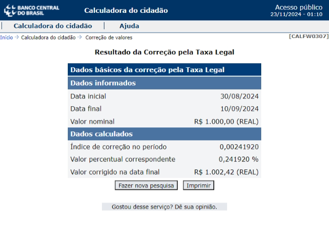

# Metodologia de Cálculo da Taxa Legal

Este documento descreve detalhadamente a metodologia utilizada para calcular juros baseados na **Taxa Legal**, conforme a lógica empregada pela [calculadora do Banco Central do Brasil](https://www3.bcb.gov.br/CALCIDADAO/publico/exibirFormCorrecaoValores.do?method=exibirFormCorrecaoValores&aba=6). A abordagem considera dias específicos de inadimplência e utiliza taxas diárias derivadas das taxas mensais publicadas.

---

## Conceitos Básicos

- **Taxa Legal Mensal**: Percentual aplicado para o cálculo de correções financeiras, divulgado mensalmente.  
- **Taxa Legal Diária**: Valor diário derivado da taxa mensal, calculado proporcionalmente ao número de dias do mês.  
- **Período Inadimplente**: Período entre a data inicial e a data final, em que o débito está sujeito à aplicação de juros.

---

## Tabelas Utilizadas

### Taxa Legal Mensal

| Ano  | Mês      | Taxa Mensal (%) |
|------|----------|-----------------|
| 2024 | Agosto   | 0.605306        |
| 2024 | Setembro | 0.676227        |
| 2024 | Outubro  | 0.704241        |
| 2024 | Novembro | 0.385874        |

### Taxa Legal Diária

A Taxa Legal Diária é calculada utilizando a fórmula:  
\[
Taxa\ Legal\ Diária = \frac{Taxa\ Legal\ Mensal}{Número\ de\ Dias\ do\ Mês}
\]

| Ano  | Mês      | Taxa Diária (%)        |
|------|----------|------------------------|
| 2024 | Agosto   | 0.019526               |
| 2024 | Setembro | 0.0225409              |
| 2024 | Outubro  | 0.022717451612903224   |
| 2024 | Novembro | 0.012862466666666666   |

É fundamental não arredondar os valores da Taxa Diária (%). Apesar de a [Resolução CMN nº 5.171](https://www.bcb.gov.br/content/estabilidadefinanceira/especialnor/Resolu%C3%A7%C3%A3o5171.pdf) exigir que a Taxa Legal Mensal seja expressa com **seis casas decimais**, a mesma regra **não** se aplica à Taxa Legal Diária. Esta é calculada com base no número de dias do mês, resultando em valores com maior precisão decimal. Qualquer arredondamento precoce pode comprometer a exatidão nos cálculos finais de juros.

---

## Simulação de Cálculo

### Dados de Entrada

- **Data inicial**: 30/08/2024  
- **Data final**: 10/09/2024  
- **Valor nominal**: R$ 1000,00  

---

### Etapas do Cálculo

#### 1. Identificação do Período Inadimplente

O cálculo da Taxa Legal considera que o **primeiro dia de vencimento é contado como inadimplente**, enquanto o **último dia da data de atualização não é considerado** no período de cálculo. Essa abordagem é baseada na metodologia utilizada pela [calculadora do Banco Central do Brasil](https://www3.bcb.gov.br/CALCIDADAO/publico/exibirFormCorrecaoValores.do?method=exibirFormCorrecaoValores&aba=6).

Por exemplo:

- **Agosto**: O dia 30/08 é o primeiro dia de vencimento e, portanto, conta como inadimplente. Somando também o dia 31/08, temos 2 dias inadimplentes.
- **Setembro**: Os dias 01/09 a 09/09 são considerados inadimplentes, mas o dia 10/09, que é a data final de atualização, **não entra no cálculo**. Isso resulta em 9 dias inadimplentes.

Essa lógica deve ser observada em todos os cálculos, pois é determinante para o correto apuramento do período inadimplente e, consequentemente, para o cálculo dos juros aplicáveis.

#### 2. Cálculo da Taxa Legal Total

##### Fórmula  

\[
Taxa\ Legal\ Total = \sum_{mês} \left( Taxa\ Legal\ Diária \times Dias\ Inadimplentes\ no\ Mês \right)
\]

##### Aplicação  

- **Agosto**:  
\[
0.019526\% \times 2\ dias = 0.039052\%
\]  

- **Setembro**:  
\[
0.0225409\% \times 9\ dias = 0.2028681\%
\]  

- **Taxa Total**:  
\[
0.039052\% + 0.2028681\% = 0.2419201\%
\]

#### 3. Cálculo do Valor Corrigido

##### Fórmulas  

1. **Cálculo dos Juros Aplicados (Arredondado para Duas Casas Decimais)**  
   \[
   Juros = \text{round}\left(Valor\ Nominal \times \frac{Taxa\ Legal\ Total}{100}, 2\right)
   \]  

2. **Cálculo do Valor Corrigido (Arredondado para Duas Casas Decimais)**  
   \[
   Valor\ Corrigido = \text{round}\left(Valor\ Nominal \times \left( 1 + \frac{Taxa\ Legal\ Total}{100} \right), 2\right)
   \]  

3. **Índice de Correção (Taxa Total como decimal arredondado para oito casas decimais)**  
   \[
   Índice\ de\ Correção = \text{Arredondar} \left( \frac{\text{Taxa\ Legal\ Total}}{100}, 8 \right)
   \]

4. **Taxa Total em Percentual (Arredondado para Seis Casas Decimais)**  
   \[
   Taxa\ Total\ Formatada = \text{Arredondar} \left( \text{Taxa\ Legal\ Total}, 6 \right)
   \]

---

##### Aplicação  

- **Valor Nominal:** R$ 1000,00  
- **Taxa Legal Total:** 0,2419201%  

1. **Cálculo dos Juros Aplicados**  
   \[
   Juros = 1000,00 \times \frac{0,2419201}{100} = R\$ 2,419201
   \]  
   **Juros (Arredondado para Duas Casas Decimais):**  
   \[
   Juros = R\$ 2,42
   \]  

2. **Cálculo do Valor Corrigido**  
   \[
   Valor\ Corrigido = 1000,00 \times \left( 1 + \frac{0,2419201}{100} \right) = 1000,00 \times 1,002419201 = R\$ 1.002,419201
   \]  
   **Valor Corrigido (Arredondado para Duas Casas Decimais):**  
   \[
   Valor\ Corrigido = R\$ 1.002,42
   \]  

3. **Índice de Correção**  
   **Valor Puro (Antes do Arredondamento):**  
   \[
   Índice\ de\ Correção = \frac{0,2419201}{100} = 0,002419201
   \]  

   **Valor Arredondado (8 Casas Decimais):**  
   \[
   Índice\ de\ Correção = 0,00241920
   \]  

4. **Taxa Total em Percentual Formatado**  
   **Valor Puro (Antes do Arredondamento):**  
   \[
   Taxa\ Legal\ Total = 0,2419201
   \]  

   **Valor Arredondado (6 Casas Decimais):**  
   \[
   Taxa\ Total\ Formatada = 0,241920
   \]  

---

#### Resultado Final  

- **Índice de Correção:** 0,00241920  
- **Taxa Total (%):** 0,241920  
- **Juros Aplicados:** R$ 2,42  
- **Valor Corrigido:** R$ 1002,42  

## Resultado Final

Os juros aplicáveis ao valor de R$ 1000,00, considerando o período inadimplente de 30/08/2024 a 10/09/2024, totalizam **R$ 2,42 (dois reais e quarenta e dois centavos)**.

Imagem: Calculo realizado na calculadora do BC.

---

## Observações Importantes

1. **Método de Contagem de Dias**:  
   - O dia de vencimento (30/08) é contado como inadimplente.  
   - O último dia do período (10/09) **não** aplica juros, seguindo a lógica da [calculadora do Banco Central do Brasil](https://www3.bcb.gov.br/CALCIDADAO/publico/exibirFormCorrecaoValores.do?method=exibirFormCorrecaoValores&aba=6).  

2. **Taxas como Referência**:  
   - O Banco Central recomenda que os cálculos da calculadora sejam utilizados apenas como **referência**, e não como valores oficiais. ([Fonte](https://www.bcb.gov.br/detalhenoticia/20356/noticia))

3. **Adaptação a Outras Metodologias**:  
   - Outras instituições financeiras podem adotar metodologias diferentes, o que pode alterar o valor final.  

Este projeto segue a metodologia do Banco Central para facilitar a consistência no cálculo, mas está aberto a discussões sobre outras abordagens mais detalhadas ou lucrativas.

---

Para dúvidas ou colaborações, entre em contato via [LinkedIn](https://www.linkedin.com/in/guilherme-lim/).  
